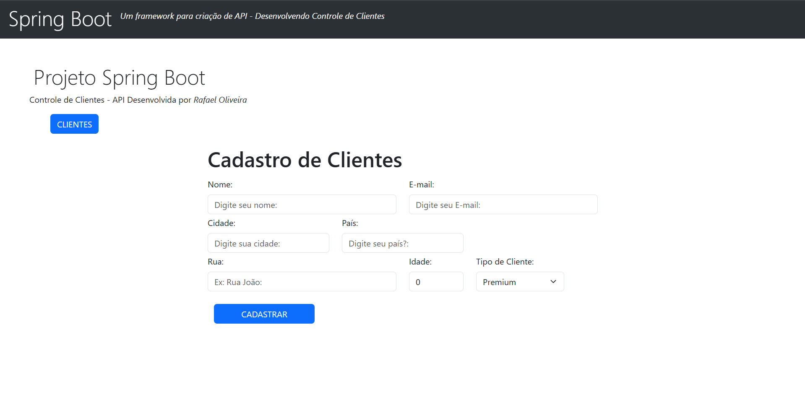
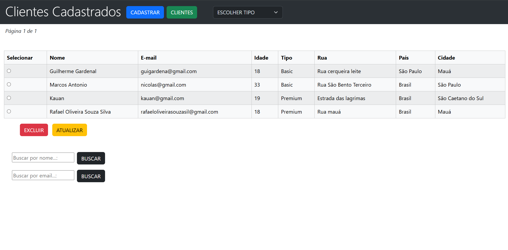
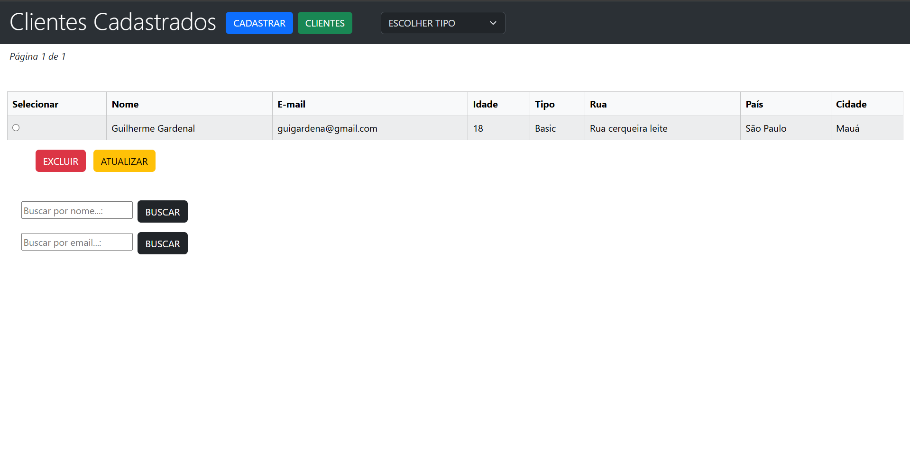
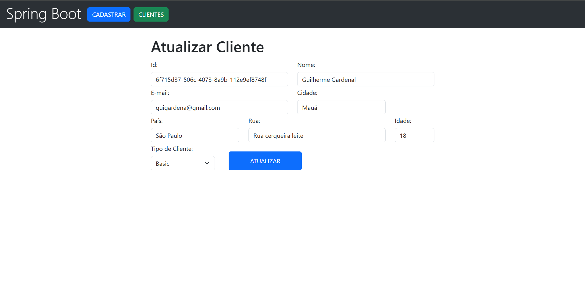

### Projeto CRUD - Spring Boot (Controle de Clientes)

Projeto Simples feito para desenvolver minha habilidades nas seguintes tecnologias:  

- Java
- Spring Boot
- Thymeleaf
- Bootstrap
- Postgresql

___

O usuário terá a possibilidade de criar, atualizar, deletar e visualizar os clientes no sistema!  
O sistema possui um visual simples e de facil usabilidade.

### Tela de Cadastro de Clientes

 - Nessa tela o usuário irá inserir os dados do cliente, também tendo a opção de exibir os clientes já cadastrados no sistema clicando no botão (CLIENTES)

### Exibição de Clientes

- Nessa tela o usuário terá todos os clientes já cadastrados no sistema!
- Busca por nome.
- Busca por email.
- Filtro por tipo.  
O usuário também terá a possibilidade de excluir e atualizar o cliente selecionado!

### Busca por Nome | Tipo | Email

- Exemplo de busca por nome.

### Atualização de Dados

- Após selecionar o cliente desejado e clicar no botão de (atualizar), será redirecionado para essa tela onde as informações do cliente serão apresentadas.
- Todos os dados podem ser alterados, menos o ID do cliente que é apenas visivel!
